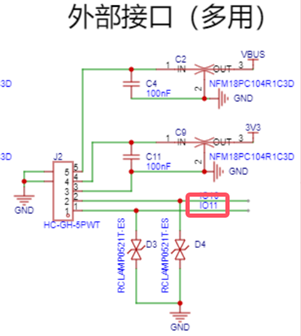

# ESP32S3 SR WS2812 项目说明

本项目基于 立创实战派ESP32S3 开发板，实现对 WS2812 灯带的控制，并集成了语音识别（SR）功能。适用于智能家居、灯光控制等场景。<br>
目前可以通过语音控制 WS2812 灯带的若干显示效果，包括单色常亮、闪烁、呼吸、彩色渐变和流光等效果。<br>

## 硬件连接

WS2818需要接三根线：VCC，DIN，GND。也就是除去电源和地，只需要接一根数据线即可。<br>
立创实战派ESP32S3开发板引出了少量GPIO可以使用，我将WS2818的数据线接到了IO 11上。<br>
<br>
对应板子上就是左边的拓展口最右边那个pin，我们用板子附赠的拓展线接出来。<br>
<br>
具体接线如下：<br>
红线（5V）   ---------- WS2812 VCC<br>
黑线（GND）  ---------- WS2812 GND<br>
绿线（IO 11）---------- WS2812 DIN<br>

## 语音指令

目前实现的语音指令如下：
```c
    esp_mn_commands_add(1, "guan deng"); // 关灯
    //红色
    esp_mn_commands_add(2, "hong se shan shuo"); // 闪烁
    esp_mn_commands_add(3, "hong se hu xi"); // 呼吸
    esp_mn_commands_add(4, "hong se chang liang"); // 常亮
    //绿色
    esp_mn_commands_add(5, "lv se shan shuo"); // 闪烁
    esp_mn_commands_add(6, "lv se hu xi"); // 呼吸
    esp_mn_commands_add(7, "lv se chang liang"); // 常亮
    //蓝色
    esp_mn_commands_add(8, "lan se shan shuo"); // 闪烁
    esp_mn_commands_add(9, "lan se hu xi"); // 呼吸
    esp_mn_commands_add(10, "lan se chang liang"); // 常亮
    //彩色
    esp_mn_commands_add(11, "cai se jian bian"); // 彩色渐变
    esp_mn_commands_add(12, "cai se liu guang"); // 彩色流光
```

## 图片展示

彩色流光效果如下：<br>
 <br>
